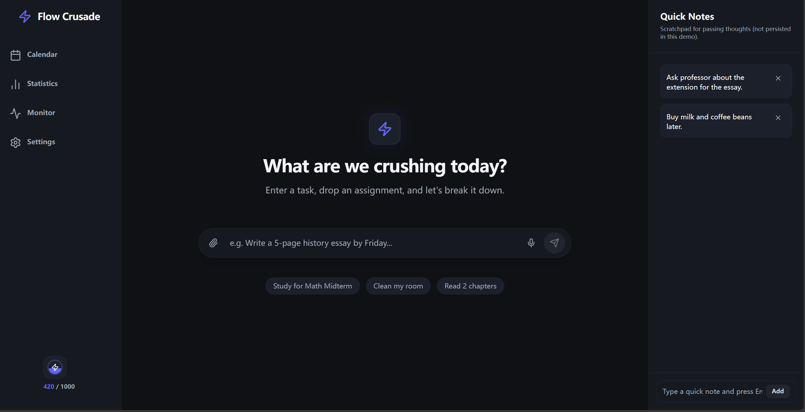
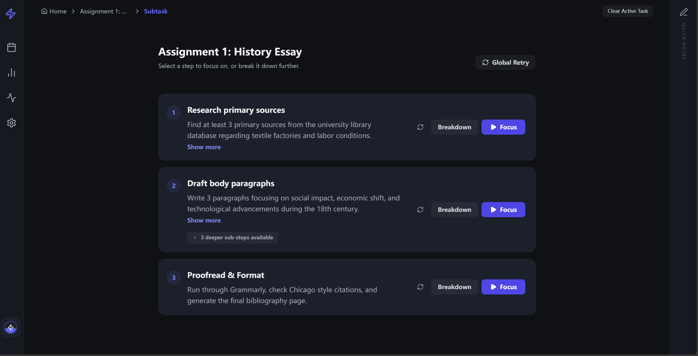
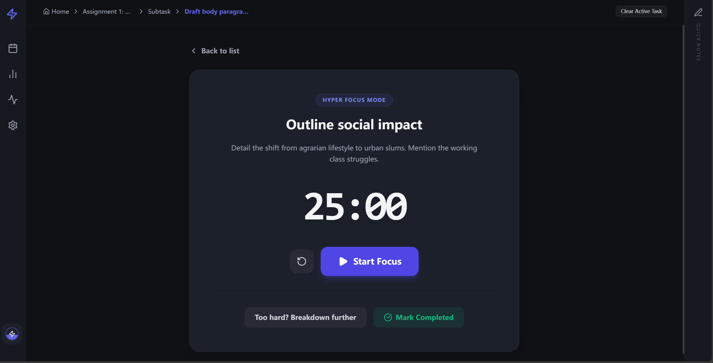
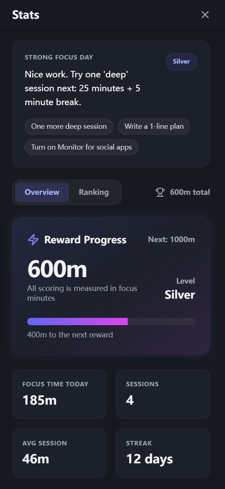
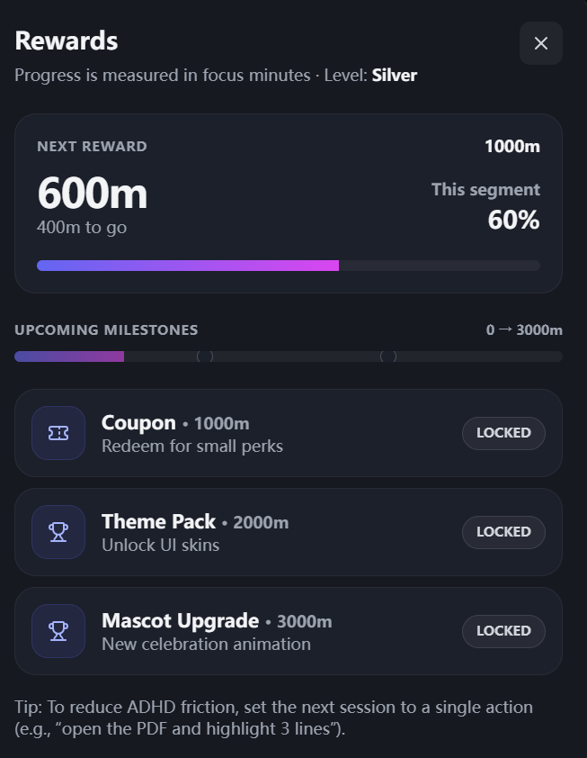
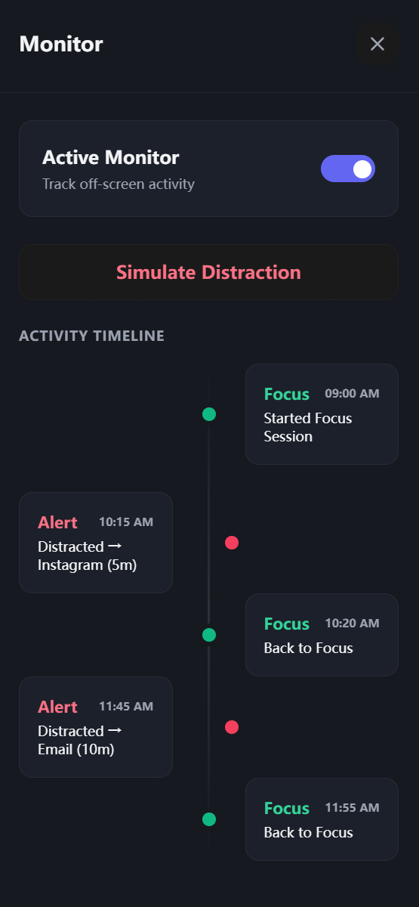

# Flow Crusade (Frontend Demo)

### ADHD-friendly focus system designed to reduce initiation friction and sustain deep work

<p align="center">
  
</p>

<p align="center">
  <b>Break tasks → Enter flow → Track progress → Reinforce focus loops</b>
</p>

<p align="center">
  
  
  
  
</p>

---

# 🧠 Concept


**Flow Crusade** is a productivity interface designed specifically for ADHD-like cognitive workflows, where the hardest step is often simply starting.

Instead of overwhelming users with large goals, it:

* converts tasks into small executable steps
* lowers activation energy for focus
* provides immediate feedback and reinforcement
* visualizes progress to sustain momentum

This transforms:

> “I can’t start.”
> → into
> “I can do this one step now.”

---

# ✨ Core Features

## 🪜 Recursive Task Breakdown

<p align="center">

</p>

**Convert overwhelming goals into executable units**

Capabilities:

• infinite task → subtask → sub-subtask hierarchy
• breadcrumb navigation
• drill-down execution model

Mental effect:

> reduces cognitive load and decision paralysis

---

## ⏱ Focus Mode

<p align="center">

</p>

Enter a dedicated execution state.

Features:

• start / pause / resume sessions
• visual timer feedback
• single-task isolation

Designed to minimize:

• context switching
• avoidance loops

---
## 📊 Feedback & Reinforcement System

<table align="center">
<tr>
<td align="center">
<br>
<b>Statistics</b><br>
Behavior metrics & trends
</td>
<td align="center">
<br>
<b>Rewards</b><br>
Gamified reinforcement
</td>
<td align="center">
<br>
<b>Monitor</b><br>
Distraction tracking
</td>

</tr>
</table>

---

## 📝 Quick Notes Capture

Prevents derailment from intrusive thoughts.

Instead of switching tasks:

→ capture instantly
→ continue focus

---
## 🧱 Tech Stack

- **React** + **Vite** (fast dev server + modern build)
- **Tailwind CSS** for styling
- **lucide-react** icons (UI icon set used throughout)

---

## 🚀 Local Development

### 1) Clone
```bash
git clone https://github.com/Bingxi-Jiang/Flow-Crusade_frontend.git
cd Flow-Crusade_frontend
````

### 2) Install

```bash
npm install
```

### 3) Run (Dev)

```bash
npm run dev
```

Vite will start a local dev server (commonly):

* [http://localhost:5173](http://localhost:5173)

---

## 📦 Production Build

```bash
npm run build
npm run preview
```

* Build output: `dist/`

---

## 🗂️ Project Structure (high-level)

```text
Flow-Crusade_frontend/
├─ public/                 # static assets (put screenshots here)
├─ src/
│  ├─ App.jsx              # main demo app (UI + demo logic)
│  ├─ main.jsx             # react entry
│  └─ index.css            # tailwind entry
├─ index.html
├─ package.json
├─ vite.config.js
├─ tailwind.config.js
└─ postcss.config.js
```

---

## 🧪 Notes (This is a Demo)

* Current data (tasks, stats, events, notes) is demo/mock-driven to showcase UX.
* “Monitor” and “Rewards” are implemented as product-like flows, but they’re **not yet connected to a real backend** in this frontend repo.

---

## 🛣️ Roadmap (Suggested)

* [ ] Real persistence (LocalStorage / IndexedDB)
* [ ] Integrate with backend (task generation + monitoring signals)
* [ ] Export stats + streaks


---

## 🤝 Contributing

PRs are welcome — especially for:

* UI polish (animations, micro-interactions)
* Better breakdown UX (keyboard-first, quick refine)
* Accessibility & mobile ergonomics

---

## 📄 License

Educational / personal demo use.

